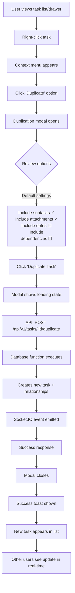
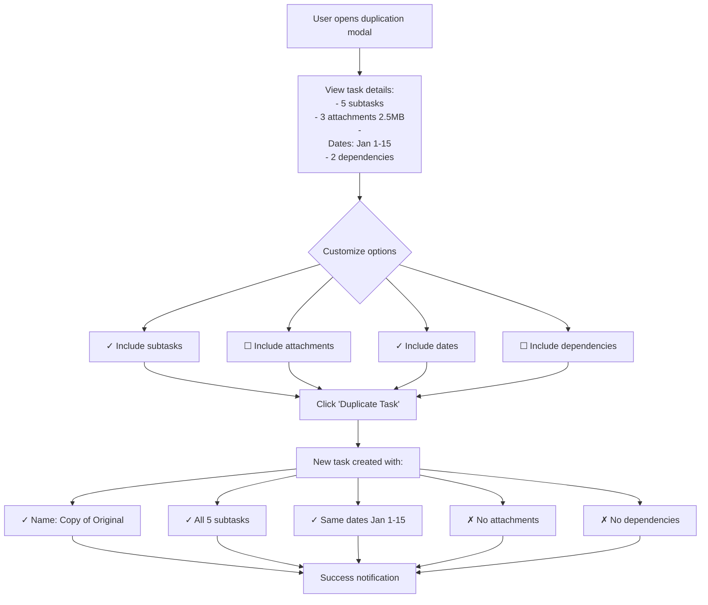
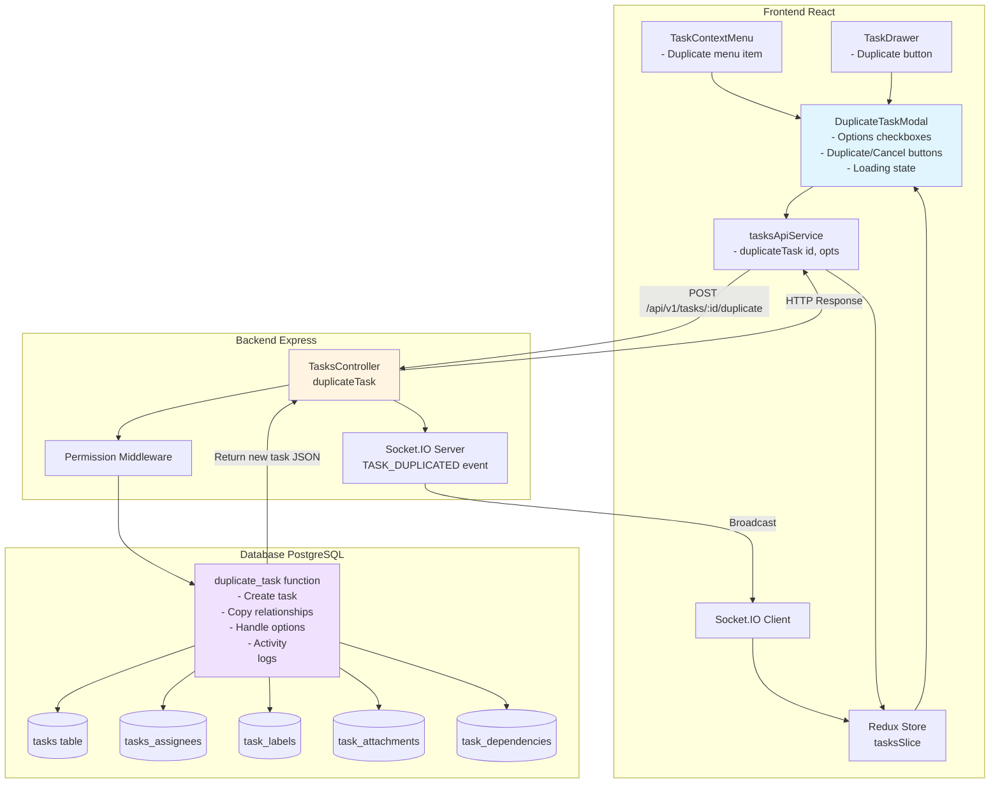

### Overview

 **Background**

  Worklenz currently lacks a task duplication feature, requiring users to manually recreate similar tasks with
  identical properties, assignees, labels, and configurations. This is time-consuming and error-prone, especially
  for recurring work patterns or template-based workflows.

  **Purpose**

  Implement a comprehensive task duplication feature similar to Asana that allows users to quickly create copies of
  existing tasks with configurable options for what gets duplicated (subtasks, attachments, dates, dependencies).

  **Scope**

  This feature encompasses:
  - Backend API endpoint and database function for task duplication
  - Frontend UI components (context menu action, duplication modal)
  - Real-time collaboration via Socket.IO
  - Internationalization for all 6 supported languages
  - Permission and validation handling
  - Activity logging and audit trail

  **User Personas**

  - Project Manager: Needs to create similar tasks across different phases or sprints
  - Team Lead: Wants to replicate task structures for recurring work patterns
  - Individual Contributor: Needs to create task variations with similar configurations

### Goals & Non-goals

 **Goals**

  ✅ Enable efficient task duplication
  - Users can duplicate any task they have permission to view in a single click
  - Reduce manual data entry and improve productivity

  ✅ Provide flexible duplication options
  - Users control what gets copied (subtasks, attachments, dates, dependencies)
  - Support different use cases with configurable modal

  ✅ Maintain data integrity
  - Ensure all duplicated data is valid and consistent
  - Prevent circular dependencies and invalid states
  - Proper permission enforcement

  ✅ Real-time collaboration
  - All project members see duplicated tasks immediately
  - Socket.IO events keep everyone synchronized

  ✅ Complete internationalization
  - Full support for all 6 languages (en, de, es, pt, zh, alb)

  **Non-Goals**

  ❌ Bulk duplication - Duplicating multiple tasks at once (future enhancement)

  ❌ Cross-project duplication - Duplicating tasks to different projects (future enhancement)

  ❌ Template creation - Converting duplicated tasks into reusable templates (separate feature)

  ❌ Relative date shifting - Automatically adjusting dates relative to today (future enhancement)

### Requirements (Functional & Non-functional)

 Functional Requirements

  FR-1: Duplicate Action Access Points

  FR-1.1 Task Context Menu Integration
  - Add "Duplicate" menu item to task context menu (right-click)
  - Position between "Convert to/from subtask" and "Archive" options
  - Visible only when user has task creation permissions
  - Available for both parent tasks and subtasks
  - Disabled for archived or deleted tasks

  FR-1.2 Task Drawer Integration (Optional)
  - Add duplicate icon button to task drawer header
  - Tooltip: "Duplicate task"
  - Positioned near archive/delete actions

  FR-1.3 Keyboard Shortcut (Optional)
  - Ctrl/Cmd + D when task is focused or drawer is open

  FR-2: Duplication Options Modal

  FR-2.1 Modal Structure
  - Title: "Duplicate Task"
  - Subtitle: Display original task name
  - Preview section showing what will be duplicated
  - Configuration checkboxes
  - Action buttons

  FR-2.2 Configuration Options

  | Option       | Label                | Description                                         | Default     |  Disabled When         | 
 |--------------|----------------------|-----------------------------------------------------|-------------|-------------------|
  | Subtasks     | Include subtasks     | "Duplicate all [X] subtasks with their properties"  | ✓ Checked   | No  subtasks exist     |
  | Attachments  | Include attachments  | "Create references to all [X] attachments ([size])" | ✓ Checked   | No attachments exist  |
  | Dates        | Include dates        | "Copy start and end dates ([date range])"           | ☐ Unchecked | -                  |
  | Dependencies | Include dependencies | "Copy blocked-by relationships ([X] dependencies)"  | ☐ Unchecked | No  dependencies exist |

  FR-2.3 Action Buttons
  - Primary: "Duplicate Task" (always enabled)
  - Secondary: "Cancel"

  FR-3: Core Task Property Duplication

  FR-3.1 Always Duplicated Properties
  ✓ Task name → "Copy of [Original Name]" (max 500 chars)
  ✓ Description (full rich text HTML)
  ✓ Status (same as original)
  ✓ Priority (same as original)
  ✓ Phase assignment
  ✓ Billable flag
  ✓ Project assignment

  FR-3.2 Always Duplicated Relationships
  ✓ All assignees (tasks_assignees table)
  ✓ All labels (task_labels table)
  ✓ All custom field values (cc_column_values table)
  ✓ All subscribers (task_subscribers table)

  FR-3.3 Never Duplicated
  ✗ Task ID (new UUID generated)
  ✗ Task number (auto-incremented)
  ✗ Timestamps (created_at, updated_at, completed_at)
  ✗ Done status (always false)
  ✗ Archived status (always false)
  ✗ Comments and reactions
  ✗ Activity logs
  ✗ Time tracking data (work logs)
  ✗ Total minutes (set to 0/NULL)
  ✗ Recurring schedule configuration

  FR-3.4 New Task Properties
  → Reporter ID: User performing duplication
  → Created at: Current timestamp
  → Updated at: Current timestamp
  → Sort order: Top of status column

  FR-4: Subtask Duplication Logic

  FR-4.1 When Enabled
  - Duplicate all subtasks recursively
  - Maintain parent-child relationships (new parent → new subtasks)
  - Preserve subtask sort order
  - Apply same duplication rules (FR-3) to each subtask
  - Copy subtask assignees, labels, custom fields
  - Do NOT copy subtask comments, time logs, or activity

  FR-4.2 Naming Convention
  - Parent task: "Copy of [Original Name]"
  - Subtasks: Original names (no "Copy of" prefix)

  FR-4.3 Hierarchy Validation
  - Respect 2-level hierarchy limit
  - Skip any nested subtasks beyond 2 levels (edge case)

  FR-5: Attachment Duplication Logic

  FR-5.1 When Enabled
  - Create new attachment records in task_attachments
  - Reference same files in storage (no file copying)
  - Copy metadata: name, size, type
  - Set uploaded_by to duplicating user
  - Set created_at to current timestamp
  - Maintain attachment order

  FR-5.2 Failure Handling
  - If attachment copying fails, continue with task duplication
  - Show warning: "Task duplicated but some attachments could not be copied"
  - Log error for debugging

  FR-6: Date Handling Logic

  FR-6.1 When Enabled
  - Copy start_date exactly as-is
  - Copy end_date exactly as-is

  FR-6.2 When Disabled
  - Set start_date to NULL
  - Set end_date to NULL

  FR-6.3 Validation
  - Validate end_date >= start_date
  - Respect project timeline boundaries (if applicable)

  FR-7: Dependency Duplication Logic

  FR-7.1 When Enabled
  - Copy all "blocked_by" relationships from task_dependencies
  - Reference original blocking tasks (not their duplicates)
  - Validate no circular dependencies created

  FR-7.2 When Disabled
  - Create task with no dependencies

  FR-7.3 Circular Dependency Prevention
  - Check for circular dependency chains
  - Skip dependencies that would create cycles
  - Show warning: "Some dependencies were skipped to prevent circular references"

  FR-8: Activity Logging

  FR-8.1 Original Task Activity Log
```
  {
    "activity_type": "duplicated",
    "message": "Task duplicated by [User Name]",
    "link_to": "new_task_id"
  }

```
  FR-8.2 New Task Activity Log
```
  {
    "activity_type": "create",
    "message": "Created from duplicate of [Original Task Name]",
    "link_to": "original_task_id"
  }
```

  FR-9: API Implementation

  FR-9.1 Endpoint
`  POST /api/v1/tasks/:taskId/duplicate
`
  FR-9.2 Request Body
```
  {
    "include_subtasks": boolean,
    "include_attachments": boolean,
    "include_dates": boolean,
    "include_dependencies": boolean
  }
```

  FR-9.3 Success Response (200 OK)
```
  {
    "id": "new-task-uuid",
    "name": "Copy of Original Task",
    "project_id": "project-uuid",
    "task_no": 12345,
    "status_id": "uuid",
    "priority_id": "uuid",
    "assignees": [...],
    "labels": [...],
    "subtasks": [...],
    "custom_fields": [...]
  }
```

  FR-9.4 Error Responses
  - 404 Not Found: Task not found
  - 403 Forbidden: Permission denied
  - 400 Bad Request: Invalid request body
  - 500 Internal Server Error: Server error during duplication

  FR-10: Database Function

  FR-10.1 Function Signature
```
  CREATE OR REPLACE FUNCTION duplicate_task(
    _task_id UUID,
    _user_id UUID,
    _include_subtasks BOOLEAN DEFAULT true,
    _include_attachments BOOLEAN DEFAULT true,
    _include_dates BOOLEAN DEFAULT false,
    _include_dependencies BOOLEAN DEFAULT false
  ) RETURNS json
```

  FR-10.2 Transaction Requirements
  - All operations in single transaction
  - Rollback on any error
  - Return complete task object with relationships

  FR-10.3 Operation Sequence
  1. Validate task exists and user has permissions
  2. Create new task record with duplicated properties
  3. Copy assignees to tasks_assignees
  4. Copy labels to task_labels
  5. Copy phase to task_phase
  6. Copy custom field values to cc_column_values
  7. Copy subscribers to task_subscribers
  8. Conditionally copy attachments to task_attachments
  9. Conditionally copy dependencies to task_dependencies
  10. Conditionally duplicate subtasks (recursive call)
  11. Create activity logs for both tasks
  12. Return new task JSON with all relationships

  FR-11: Real-time Updates (Socket.IO)

  FR-11.1 Event Emission
  Event: 'TASK_DUPLICATED'
  Target: All project members
```
  Payload: {
    original_task_id: "uuid",
    new_task: { /* complete task object */ },
    project_id: "uuid",
    duplicated_by: "user-uuid"
  }
```

  FR-11.2 Client-side Handling
  - Add new task to Redux store
  - Update task counts in project
  - Update all task list views (table, kanban, gantt)
  - Show notification to other users: "[User] duplicated a task"

  FR-12: User Interface Updates

  FR-12.1 Loading States
  - Disable duplicate button during operation
  - Show loading spinner in modal
  - Disable all modal inputs during processing
  - Button text changes to "Duplicating..."

  FR-12.2 Success Feedback
  - Close modal automatically
  - Show success toast: "Task duplicated successfully"
  - Auto-open new task drawer (optional)
  - Highlight new task in list with animation (optional)

  FR-12.3 Error Feedback
  - Keep modal open on error
  - Display error message inline in modal
  - Specific messages per error type
  - Re-enable modal inputs

  FR-12.4 Navigation
  - Toast notification includes "View task" action
  - Click to open duplicated task drawer

  FR-13: Permissions and Validation

  FR-13.1 Permission Checks
  - User must have VIEW permission on original task
  - User must have CREATE_TASK permission in project
  - User must be active project member
  - User's team must be active (not archived)

  FR-13.2 Validation Rules
  - Original task must not be deleted
  - Project must be active (not archived)
  - Task name length ≤ 500 chars after "Copy of" prefix
  - Custom field values match current field definitions
  - Assignees must be current project members

  FR-13.3 Edge Case Handling
  - Tasks with no assignees → Duplicate with no assignees
  - Tasks with no labels → Duplicate with no labels
  - Tasks in projects without phases → Skip phase assignment
  - Deleted custom fields → Skip those field values
  - Deleted priority/status → Use project defaults

  FR-14: Internationalization

  FR-14.1 Translation Keys (English)

  Add to public/locales/en/tasks.json:
  ```
{
    "duplicate": "Duplicate",
    "duplicate_task": "Duplicate Task",
    "duplicate_options_title": "Choose what to include",
    "include_subtasks": "Include subtasks",
    "include_subtasks_desc": "Duplicate all {{count}} subtasks with their properties",
    "include_attachments": "Include attachments",
    "include_attachments_desc": "Create references to all {{count}} attachments ({{size}})",
    "include_dates": "Include dates",
    "include_dates_desc": "Copy start and end dates",
    "include_dependencies": "Include dependencies",
    "include_dependencies_desc": "Copy blocked-by relationships ({{count}} dependencies)",
    "duplicate_action": "Duplicate Task",
    "cancel": "Cancel",
    "duplicate_success": "Task duplicated successfully",
    "duplicate_error": "Failed to duplicate task",
    "view_task": "View task",
    "copy_of": "Copy of",
    "duplicating": "Duplicating task...",
    "no_subtasks": "No subtasks to duplicate",
    "no_attachments": "No attachments to duplicate",
    "no_dependencies": "No dependencies to duplicate",
    "circular_dependency_warning": "Some dependencies were skipped to prevent circular references",
    "attachment_copy_warning": "Task duplicated but some attachments could not be copied"
  }
```

  FR-14.2 Required Translations
  - German (de/tasks.json)
  - Spanish (es/tasks.json)
  - Portuguese (pt/tasks.json)
  - Chinese (zh/tasks.json)
  - Albanian (alb/tasks.json)

  FR-14.3 Dynamic Content
  - Use i18next interpolation: {{count}}, {{size}}
  - Pluralization for subtask/attachment counts
  - Locale-specific file size formatting
  - Locale-specific date formatting

  ---
  Non-Functional Requirements

  NFR-1: Performance

  | Metric                                | Target                    |
  |---------------------------------------|---------------------------|
  | Simple task duplication (no subtasks) | < 3 seconds               |
  | Task with ≤10 subtasks                | < 3 seconds               |
  | Task with ≤50 subtasks                | < 10 seconds              |
  | Database function execution           | < 2 seconds (simple task) |
  | API endpoint response time            | < 500ms (excluding DB)    |
  | Modal render time                     | < 100ms                   |
  | UI update after duplication           | < 1 second                |
  | Socket.IO broadcast latency           | < 500ms                   |

  NFR-2: Scalability

  - Support tasks with up to 100 subtasks
  - Handle 10+ concurrent duplications from different users
  - Support tasks with up to 50 attachments
  - Handle tasks with up to 50 custom fields
  - Database transaction isolation prevents race conditions

  NFR-3: Reliability

  - 99.9% success rate for valid duplication requests
  - Complete rollback on any error (atomic operation)
  - Zero data corruption on failed duplication
  - Graceful degradation for attachment copying failures
  - Transactional integrity maintained under all conditions

  NFR-4: Security

  - Row-level security enforced on all duplicate operations
  - Permission validation before duplication
  - SQL injection prevention in database function
  - Input sanitization in API endpoint
  - Audit logging for all duplication attempts
  - Rate limiting: Max 10 duplications per minute per user
  - CSRF token validation for duplicate action

  NFR-5: Maintainability

  - Follow existing Worklenz code patterns and conventions
  - Comprehensive comments in database function
  - JSDoc documentation for API endpoints
  - TypeScript interfaces for all request/response types
  - Reusable React components
  - Specific error codes for all error scenarios
  - Structured logging for debugging

  NFR-6: Usability

  - Intuitive UI with clear action labels
  - Helpful tooltips and descriptions for each option
  - Keyboard navigation support (Tab, Enter, Esc)
  - Accessible modal with ARIA labels and focus management
  - Clear, actionable error messages
  - Visual feedback for all state changes (loading, success, error)
  - Consistency with existing Worklenz UI patterns

  NFR-7: Accessibility (WCAG 2.1 Level AA)

  - Keyboard navigable modal
  - Focus trap within modal when open
  - Proper ARIA attributes for all interactive elements
  - Screen reader support for all actions and feedback
  - Sufficient color contrast (4.5:1 for normal text)
  - Visible focus indicators for all interactive elements
  - Error messages announced to screen readers

  NFR-8: Compatibility

  - Browser support: Chrome 90+, Firefox 88+, Safari 14+, Edge 90+
  - PostgreSQL 15+ compatibility
  - Works with MinIO/S3/Azure Blob storage configurations
  - Mobile responsive (tablet and desktop)
  - Dark/light theme support
  - RTL language ready (for future)

  NFR-9: Monitoring and Observability

  - Log all duplication operations (task IDs, user IDs, timestamps)
  - Track success/failure rates
  - Monitor API endpoint performance metrics
  - Alert on failure rate > 1%
  - Usage analytics dashboard
  - Error tracking with full stack traces

  NFR-10: Data Integrity

  - Foreign key constraints maintained for all relationships
  - Referential integrity enforced at database level
  - No orphaned records on failure
  - Unique task numbers guaranteed
  - Timestamp consistency across related records
  - Custom field values match current field definitions

  NFR-11: Backward Compatibility

  - No breaking changes to existing task APIs
  - Existing task list views work without modification
  - Database migrations are reversible
  - No impact on existing Socket.IO events
  - Seamless integration with current codebase

### User Flows / Diagrams

**1.  Basic Task Duplication Flow**


2. Duplication with Selective Options


3. System Architecture Diagram



### Acceptance Criteria

  **AC-1: Duplicate Action Availability**

  - "Duplicate" option appears in task context menu for all non-archived tasks
  - Duplicate option is disabled when user lacks create permission
  - Duplicate option is hidden for archived/deleted tasks
  - Duplicate action can be triggered from task drawer (if implemented)
  - Keyboard shortcut Ctrl/Cmd+D triggers duplicate (if implemented)

  **AC-2: Duplication Modal Functionality**

  - Modal opens when duplicate action is clicked
  - Modal displays original task name correctly
  - All 4 checkbox options are present and functional
  - Checkboxes are disabled when no data exists (e.g., no subtasks)
  - Option descriptions show accurate counts (subtasks, attachments, dependencies)
  - Default selections are applied correctly (subtasks ✓, attachments ✓, dates ☐, dependencies ☐)
  - "Duplicate Task" button creates duplicate with selected options
  - "Cancel" button closes modal without duplicating
  - Modal shows loading state during duplication
  - Modal closes automatically on success

  **AC-3: Core Task Properties Duplication**

  - New task name is "Copy of [Original Name]"
  - Description is copied exactly (including HTML formatting)
  - Status matches original task
  - Priority matches original task
  - Phase assignment matches original task
  - Billable flag matches original task
  - All assignees are copied to new task
  - All labels are copied to new task
  - All custom field values are copied to new task
  - All subscribers are copied to new task
  - New task is in same project as original
  - Reporter is set to duplicating user
  - Task number is auto-generated (unique)
  - Task ID is new UUID
  - Done status is false
  - Archived status is false
  - Created/Updated timestamps are current time
  - Completed timestamp is NULL
  - Total minutes is 0 or NULL

  **AC-4: Subtask Duplication**

  - When "Include subtasks" is checked, all subtasks are duplicated
  - Subtasks maintain parent-child relationship with new parent
  - Subtask sort order is preserved
  - Subtask names are NOT prefixed with "Copy of"
  - Subtask assignees, labels, and custom fields are copied
  - Subtask status and priority are copied
  - When "Include subtasks" is unchecked, no subtasks are created
  - Subtask count is updated correctly in UI after duplication

  **AC-5: Attachment Duplication**

  - When "Include attachments" is checked, attachment records are created
  - Attachment files are NOT copied (same storage references)
  - Attachment metadata is copied (name, size, type)
  - Uploaded by is set to duplicating user
  - Attachment order is preserved
  - When "Include attachments" is unchecked, no attachments are copied
  - Partial attachment failure shows warning but completes duplication
  - Attachment count is updated correctly in UI

  **AC-6: Date Handling**

  - When "Include dates" is checked, start and end dates are copied exactly
  - When "Include dates" is unchecked, both dates are NULL
  - Date validation prevents invalid date ranges (end < start)

  **AC-7: Dependency Duplication**

  - When "Include dependencies" is checked, all dependencies are copied
  - Dependencies reference original blocking tasks (not duplicates)
  - Circular dependencies are prevented and skipped
  - Warning shown if dependencies are skipped
  - When "Include dependencies" is unchecked, no dependencies are created

  **AC-8: Activity Logging**

  - Original task activity log shows "Task duplicated by [User]"
  - New task activity log shows "Created from duplicate of [Original Task]"
  - Activity logs link to respective tasks
  - Activity log includes timestamp and user information

  **AC-9: API Functionality**

  - POST /api/v1/tasks/:taskId/duplicate endpoint exists
  - Endpoint accepts all 4 boolean options in request body
  - Returns 200 with complete task object on success
  - Returns 404 when task not found
  - Returns 403 when user lacks permissions
  - Returns 400 for invalid request body
  - Returns 500 for server errors with proper error message
  - Response includes all relationships (assignees, labels, subtasks)

  **AC-10: Database Function**

  - duplicate_task() function exists in database
  - Function accepts task_id, user_id, and 4 boolean options
  - Function executes in single transaction
  - Function rolls back on any error
  - Function returns complete task JSON with relationships
  - Function validates permissions before duplicating
  - Function handles all relationship copying correctly

  **AC-11: Real-time Updates**

  - TASK_DUPLICATED socket event is emitted on duplication
  - Event is received by all project members
  - New task appears in task lists for all users without refresh
  - Task counts are updated in real-time
  - Other users see notification: "[User] duplicated a task"

  **AC-12: User Experience**

  - Success notification appears: "Task duplicated successfully"
  - New task is highlighted or scrolled into view in task list
  - "View task" action in notification opens new task drawer
  - Duplicate button shows loading state during operation
  - All inputs are disabled during duplication
  - Error messages are clear and actionable
  - Modal keyboard navigation works (Tab, Enter, Esc)

  **AC-13: Permissions**

  - User without VIEW permission on original task cannot duplicate
  - User without CREATE permission in project cannot duplicate
  - Inactive project members cannot duplicate tasks
  - Duplicated task assignees are validated as active project members
  - Invalid assignees are skipped with warning

  **AC-14: Edge Cases**

  - Task with no assignees duplicates successfully
  - Task with no labels duplicates successfully
  - Task with no subtasks duplicates successfully (option disabled)
  - Task with no attachments duplicates successfully (option disabled)
  - Task with deleted custom fields duplicates gracefully
  - Task with deleted priority/status uses project defaults
  - Extremely long task names are truncated to 500 chars
  - Task with 50+ subtasks duplicates within reasonable time (<10 seconds)
  - Duplicate of duplicate works correctly (creates "Copy of Copy of...")

  **AC-15: Internationalization**

  - All UI text is translated in English
  - All UI text is translated in German
  - All UI text is translated in Spanish
  - All UI text is translated in Portuguese
  - All UI text is translated in Chinese
  - All UI text is translated in Albanian
  - Dynamic counts use correct pluralization per language
  - File sizes are formatted according to locale
  - Dates are formatted according to locale
  - "Copy of" prefix is translated correctly